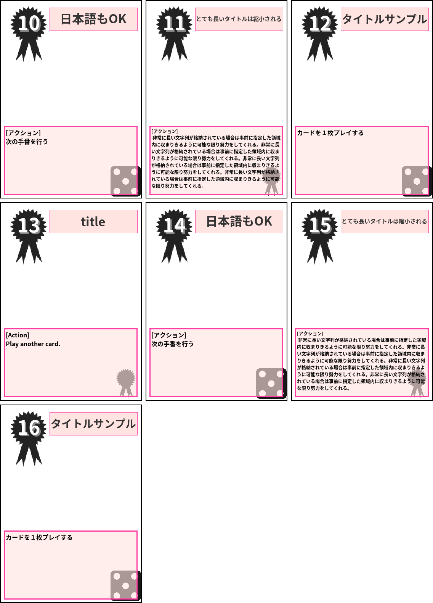

# Testplay Card Generator

(If you want to read Japanese document, [please click here](README_ja.md) ). 

How do you do when you want to play card game but the card is nothing?

Especially, when you design your board game which uses several cards,
you want to print out alpha-version card and try to adjust by using printed ones, don't you?

I hope following for the test play cards generator.

* Draw basic components, like rectangle and lines
* Draw text in the bounds
* Make multiple card images from layout file and contents file
* Generate file easy to print, like pdf format

This project can provide above features for you.


## Notice

*I assumed mainly tool user is Japanese so it explains how to use the tool by Japanese* .
If you want to develop this project, read [README for develop](README_dev.md).

```
Note: Not it is alpha version so documentation is not completed.
Moreover, how to use may be changed in future.
```

## Example

From [layout yml file](layout-sample.yml) and [card data csv file](data-sample.csv), following image(s) and PDF file can be generated.

* PNG Image




* [PDF file for print](output.pdf)


## Install

I tested it on ubuntu 18.04 and Python 3.6.5 (virtualenv).

```
# only use and install
python scripts/install.py

# setup development by virtualenv
virtualenv .venv
source .venv/bin/activate
python scripts/install.py requirements-dev.txt
```


## Preparation

And you have to prepare `layout file (yml format)` , `data file (csv format)` .

You can use `layout-sample.yml` and `data-sample.csv` for check to work the program on your computer well.


## How to use

By following command you can run program and get the `output.pdf` file for printing.

```
cd src
python main.py --layout <your layout file> --data <your data file> --output output.pdf
```

## Layout File

Layout File describe what are drawn and used from data file.
`layout-sample.yml` explains what is valid so please read if needed.


## Data File

It is CSV format and each row data is mapped for a card.
If you want to make the cards, read `layout-sample.yml` and `data.csv` and make yourself contents.


## LICENSE

This project itself is under [MIT LICENSE](LICENSE) .

But it contains Noto Font as default text rendering and the font licensed under the SIL Open Font License 1.1.

* [Noto Sans CJK JP Light](src/drawing/NotoSansCJKjp-Light.ttf) - https://www.google.com/get/noto/
* [Noto Sans CJK JP Bold](src/drawing/NotoSansCJKjp-Bold.ttf) - https://www.google.com/get/noto/
